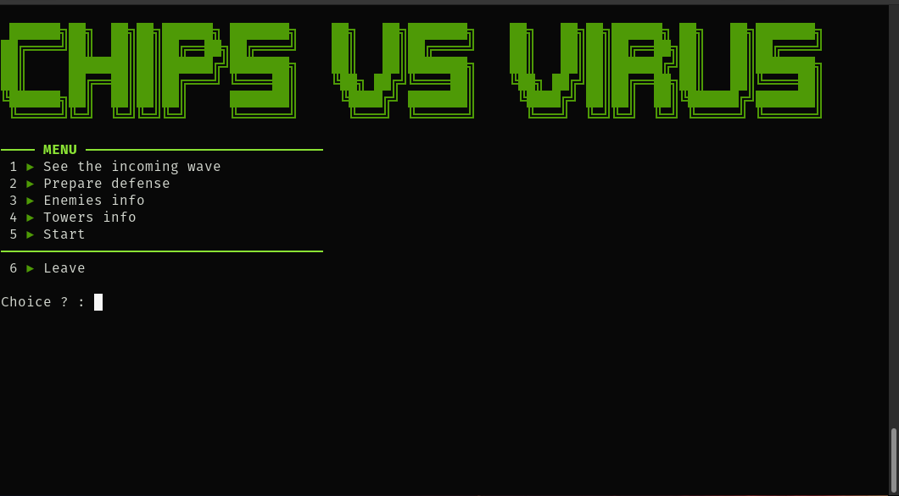
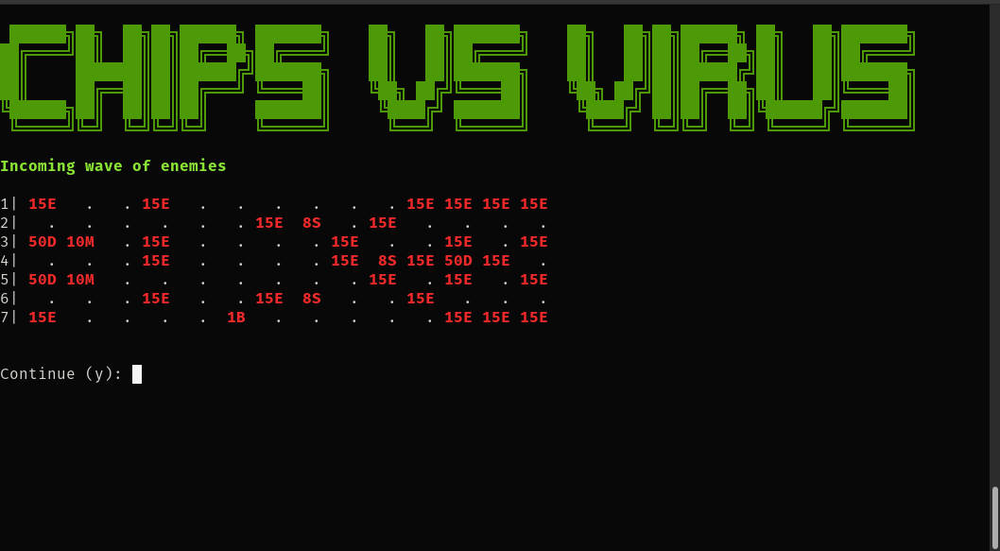
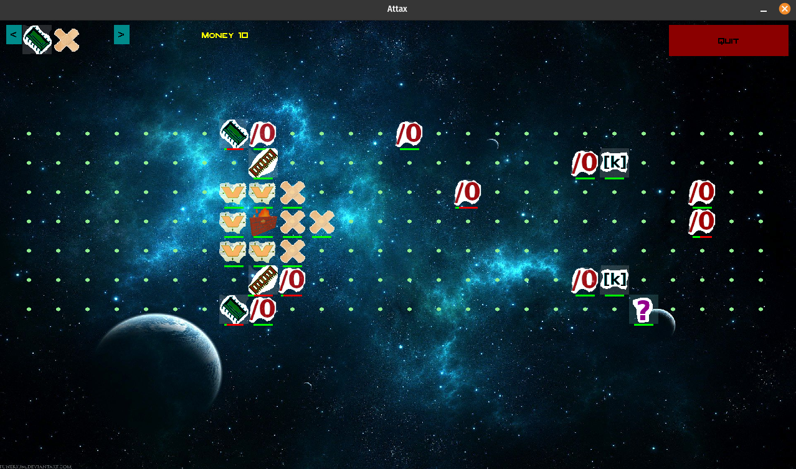
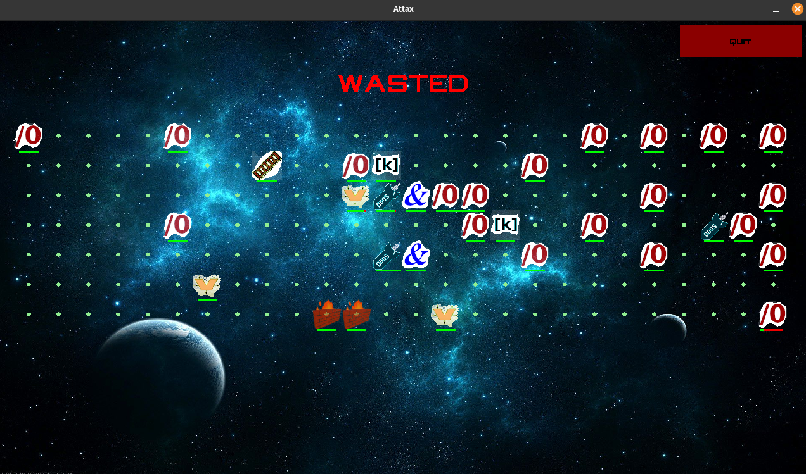

# L2-projet-c

## CLI mode
<div style="display: inline-block;">


</div>

## GUI mode
<div style="display: inline-block;">


</div>

## Prerequisite

The mlv library is needed to run the game. See [MLV Library](http://www-igm.univ-mlv.fr/~boussica/mlv/index.html)

## Help
```bash
-h      #display help
-a      #play with cli interface
-g      #play with gui interface
-x=width    #to specify gui width. Default: 1920
-y=length   #to specify gui length. Default: 1080

#! any other parameter will be considered as the path to the level file
```
## Makefile
```bash
make run-cli l=levelnumber
make run-gui l=levelnumber      #(run with 1920x1080 by default)
```

► 5 Levels are available in ./data/levels/\
► Add you own tower type in ./data/ntt_definition/tower_type\
► Add you own enemy type in ./data/ntt_definition/enemy_type\
► custom tower effects in ./data/ntt_definition/effects_by_tower_type\
► custom enemy effects in ./data/ntt_definition/effects_by_enemy_type\
► Link your entities types to their images in ./data/img/entity_icons/xxx_imgs

