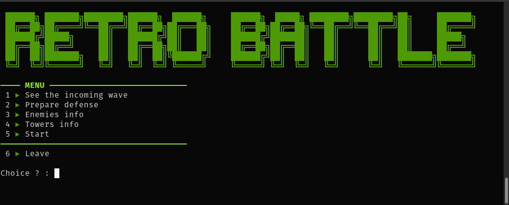
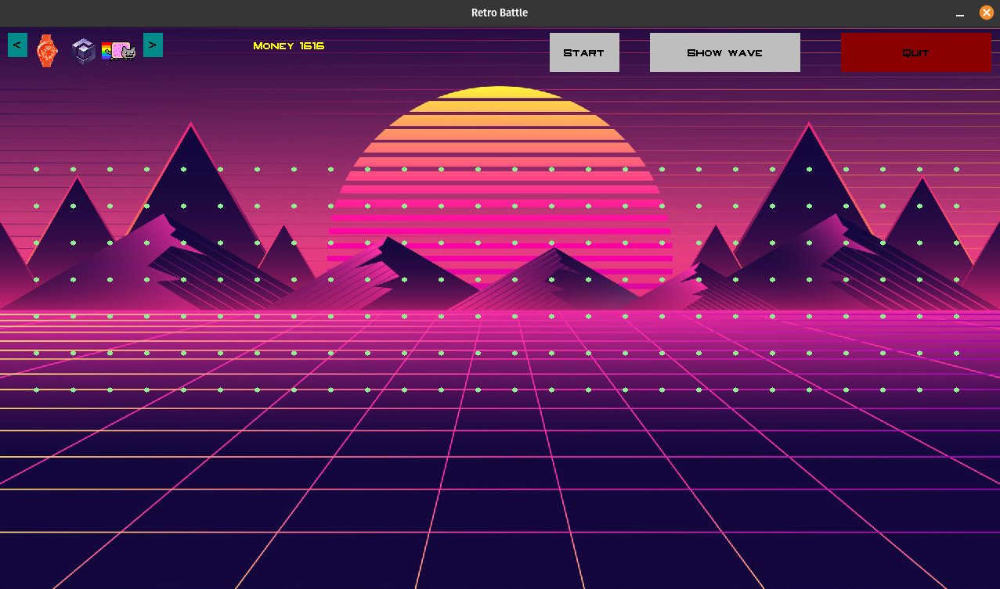

## Preview
<div style="display: inline-block;">


</div>

## Prerequisite

The mlv library is needed to run the game. See [MLV Library](http://www-igm.univ-mlv.fr/~boussica/mlv/index.html)

## Help
```bash
-h      # display help
-a      # play with cli interface
-g      # play with gui interface
-x=width    # to specify gui width. Default: 1920
-y=length   # to specify gui length. Default: 1080

# ! any other parameter will be considered as the path to the level file
```
## Makefile
```bash
make run-cli l=levelnumber
make run-gui l=levelnumber      # (run with 1920x1080 by default)
```

## Gui controls
left click to put a tower\
right click to remove a tower


## Customization

► 5 Levels are available in ./data/levels/\
► Add you own tower type in ./data/ntt_definition/tower_type\
► Add you own enemy type in ./data/ntt_definition/enemy_type\
► custom tower effects in ./data/ntt_definition/effects_by_tower_type\
► custom enemy effects in ./data/ntt_definition/effects_by_enemy_type\
► Link your entities types to their images in ./data/img/entity_icons/xxx_imgs

## Credits
#### Background music
- [Lost in Paradise - Karl Casey](https://www.youtube.com/watch?v=kee93se_K74)  @White Bat Audio (Royalty Free Music Compositions)
#### Background image
- <a href="https://www.freepik.com/vectors/background"> Background vector created by pikisuperstar - www.freepik.com</a>

#### icons
- vintage PNG Designed By QINZI from <a href="https://pngtree.com"> Pngtree.com</a>
- rubiks from <a href="https://www.freepng.fr"> freepng.fr </a>
- ferrari testarossa 1984 <a href="https://www.seekpng.com/ipng/u2q8r5e6q8e6q8q8_image-royalty-free-stock-ferrari-testarossa-1984-ferrari/"> seekpng.fr</a>
- motorola first cell phone <a href="https://www.kindpng.com/imgv/hhJwRob_cell-phone-png-old-school-motorola-first-cell/"> kindpng..com </a>
- msdos logo <a href="https://fr.m.wikipedia.org/wiki/Fichier:Msdos-icon.png"> wikipedia.org </a>
- casio watch <a href="https://www.pngwing.com/en/free-png-pfdki"> pngwing.com </a>
- blu-ray logo <a href="https://www.pngwing.com/en/free-png-zhqna"> pngwing.com </a>
- gamecube logo <a href="https://imgbin.com/png/MCvmdaKb/gamecube-controller-nintendo-64-playstation-2-doshin-the-giant-png"> imgbin.com </a>
- nyancat <a href="https://www.freepng.fr/png-kyzpdb/"> freepng.fr </a>
- ipod <a href="https://www.pngwing.com/en/free-png-zryob"> pngwing.com </a>
- ice-watch <a href="https://imgbin.com/png/VXj96VBv/ice-watch-ice-sixty-nine-ice-watch-jewellery-bracelet-png"> imgbin.com </a>


